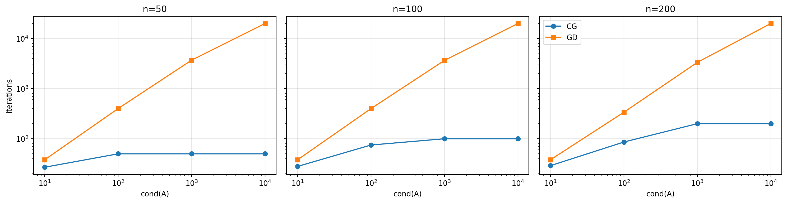

# Отчет по эксперименту 2.2
Зависимость числа итераций метода сопряженных градиентов от числа обусловленности и размерности

## 1. Постановка задачи
Сравнить число итераций CG и GD для квадратичной задачи при изменении размерности и числа обусловленности.

## 2. Функции, данные, параметры, железо
- Функция: `f(x) = 0.5 x^T A x - b^T x`.
- Генерация: SPD-матрица `A` с заданной `cond(A)`, случайный `b`.
- Параметры: `n ∈ {50, 100, 200}`, `cond(A) ∈ {10, 10^2, 10^3, 10^4}`.
- Критерий остановки: относительный по норме невязки/градиента.
- Железо: AMD Ryzen 5 5600H, RAM 16Gb

## 3. Результаты
- Рисунок: 
- На графике:
  - X: `cond(A)` (log),
  - Y: число итераций (log),
  - легенда: CG и GD.

## 4. Выводы
- CG менее чувствителен к росту обусловленности.
- GD резко замедляется на плохо обусловленных задачах.
- Наблюдения согласуются с теорией для квадратичных задач.
