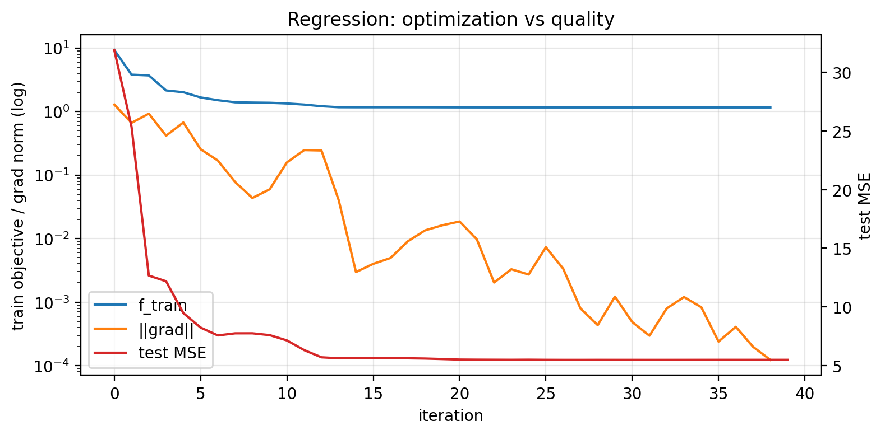
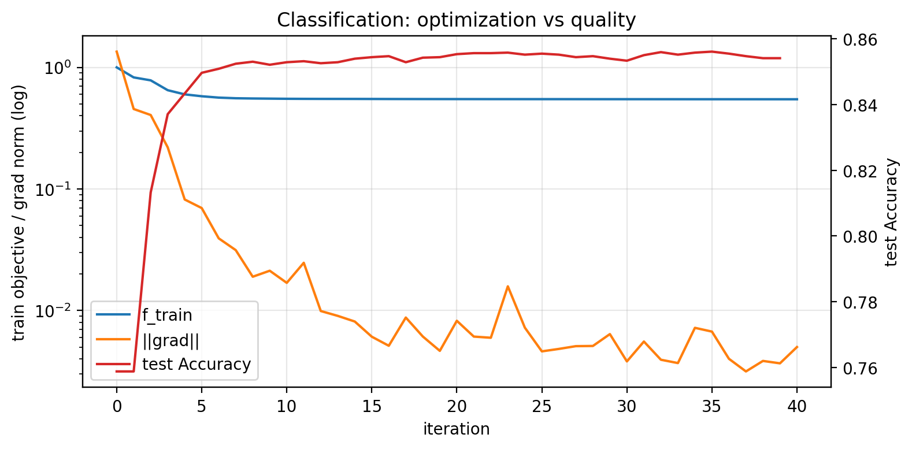

# Отчет по эксперименту 2.6
**Оптимизационная точность против качества предсказания**

## 1. Постановка задачи
Проверить, как уменьшение оптимизационной ошибки связано с качеством на тесте.

## 2. Функции, данные, параметры, железо
- Train/test split: `80/20`.
- Метод: L-BFGS.
- Оракулы: `LogCoshL2Oracle` (регрессия), `ExponentialLossL2Oracle` (классификация).
- Датасеты: LIBSVM `abalone_scale`, `a9a`.
- Метрики:
  - регрессия: MSE (при необходимости MAE),
  - классификация: Accuracy.
- Железо: AMD Ryzen 5 5600H, RAM 16Gb.

## 3. Результаты
- 
- 
- Формат графиков:
  - левая ось (log): `f_train(x_k)` и `||∇f(x_k)||`,
  - правая ось: тестовая метрика.

## 4. Выводы
- После определенного уровня оптимизационной точности прирост test-метрики замедляется/исчезает.
- Это соответствует идее о пороге достаточной оптимизации в ML.
