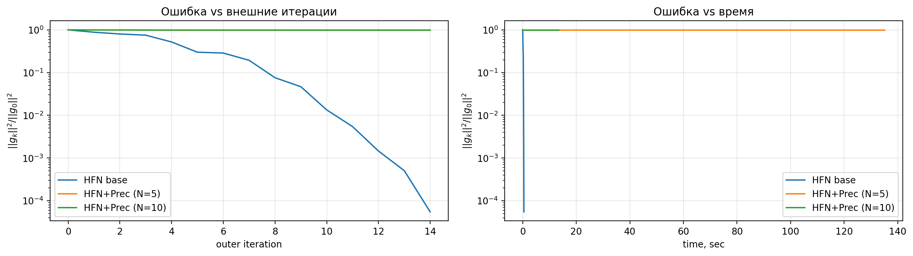
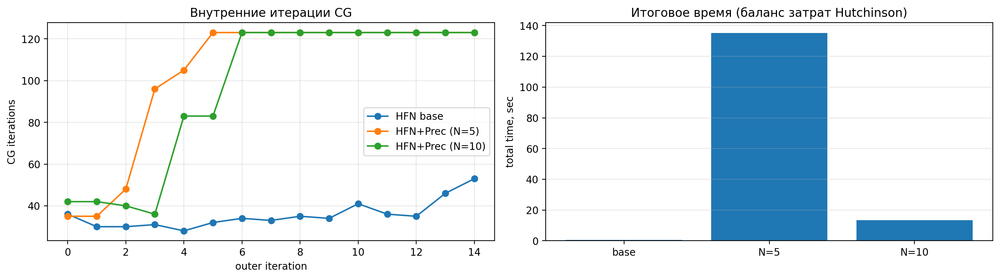

# Индивидуальный исследовательский трек 2  
Предобуславливание усеченного Ньютона и оценка Хатчинсона

## 1. Постановка задачи

Цель эксперимента — ускорить внутренний цикл CG в Hessian-Free Newton (HFN) на плохо обусловленной задаче за счет диагонального предобуславливателя, полученного через стохастическую оценку Хатчинсона.

## 2. Теоретическая основа

Для неявного гессиана $H$ диагональ оценивается как:

$$
{diag}(H) \approx v = \frac{1}{N}\sum_{i=1}^N z_i \odot (H z_i),
$$

где $z_i$ — векторы Радемахера ($\pm 1$), $\odot$ — поэлементное произведение.

Стабилизированный предобуславливатель:

$$
M_{ii} = \max(|v_i|, 10^{-6}).
$$

## 3. Данные, постановка эксперимента и параметры

- Базовый датасет: LIBSVM `a9a` (разреженный).
- Искусственное ухудшение обусловленности:
  - первая половина признаков умножается на \(1000\),
  - вторая половина признаков умножается на \(0.001\).
- Оракул: `ExponentialLossL2Oracle`, $\lambda = 1/m$.
- Сравниваются:
  - базовый HFN (без предобуславливания),
  - HFN + предобусловливание Хатчинсона.
- Критерий остановки: относительный по квадрату нормы градиента.

## 4. Результаты

- Рисунок T2-1: 
  - относительная ошибка \(\|g_k\|^2 / \|g_0\|^2\) от внешней итерации,
  - относительная ошибка \(\|g_k\|^2 / \|g_0\|^2\) от времени.
- Рисунок T2-2: 
  - число внутренних итераций CG от номера внешней итерации,
  - итоговое время работы для разных \(N\).

## 5. Анализ

1. Сходимость:  
   Сравнить наклон кривых ошибки и достижимый уровень ошибки за фиксированное время.
2. Влияние на внутренний CG:  
   Проверить, уменьшилось ли среднее число итераций CG в предобусловленном варианте.
3. Окупаемость затрат на Hutchinson:  
   На каждой итерации добавляется \(N\) вызовов `hess_vec`, но может снижаться стоимость CG.  
   Нужен диапазон \(N\), где минимизируется общее время.

## 6. Выводы

- Предобуславливание через диагональ Хатчинсона особенно полезно на плохо обусловленных задачах.
- Есть компромисс по \(N\): маленькое \(N\) даёт шумную диагональ, большое — большие накладные расходы.
- Оптимальное \(N\) выбирается эмпирически по графику времени.
