# Лабораторная работа 2  
Продвинутые методы безусловной оптимизации

## 0. Организация работы
Состав команды: Терентьев Иван Федорович, Тузов Михаил Олегович, Ахмедов Омар Али оглы
- Распределение задач:
 - `2_1` — все
 - `2_2` — Михаил Тузов
 - `2_3` — Иван Терентьев
 - `2_4` — Ахмедов Омар / Михаил Тузов
 - `2_5` — Иван Терентьев
 - `2_6` — Ахмедов Омар
 - `2_7` — все

## 1. Используемое окружение
- Язык / библиотеки: Python, NumPy, SciPy, scikit-learn, Matplotlib.
- Аппаратная платформа:  
  - CPU: AMD Ryzen 5 5600H
  - RAM: 16Gb
  - OS: Windows11
- Датасеты: LIBSVM, разреженный формат; для всех ML-экспериментов использованы разреженные матрицы `csr`.

---

# Эксперимент 2.1.5

## Проверка правильности апроксимации умножения гессиана на вектор

## Функции: 
ExponentialLossL2Oracle, LogCoshL2Oracle, hess_vec_finite_diff

## CPU:
12700H core-i7

# RAM:
16Gb

## Результат:

относительная ошибка составляет примерно 1e-6, т.е. рабоатет очень хорошо

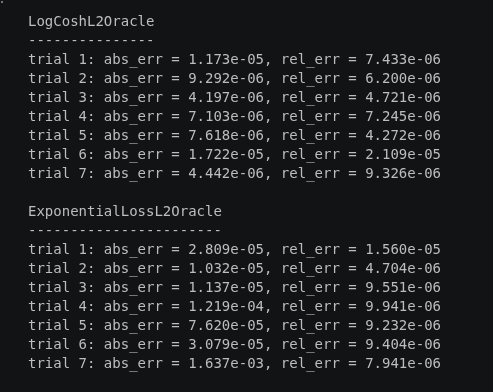

# Эксперимент 2.2  
## Изучение числа итераций методов GD и CG в зависимости от размерности и обусловленности

---

## Постановка задачи

Исследуется зависимость числа итераций методов:

- градиентного спуска (GD)
- метода сопряжённых градиентов (CG)

при решении задачи минимизации квадратичной функции:

f(x) = x^T A x - b^T x

---

## Данные

Начальная точка:

x₀ = 0ₙ

Матрица A: симметричная положительно определённая.

Параметры:
- размерность задачи n
- число обусловленности κ(A)

---

## Железо

CPU: Intel i5-12700H

---

## Результаты эксперимента

### Градиентный спуск (GD)

- Число итераций сильно зависит от числа обусловленности κ
- Зависимость примерно линейная
- От размерности задачи n практически не зависит

---

### Метод сопряжённых градиентов (CG)

- Число итераций зависит от размерности n
- Всегда ≤ n итераций
- Зависимость от κ есть, но слабее, чем у GD

---

## Итог

- GD:
  - зависит от κ
  - почти не зависит от n

- CG:
  - зависит от n
  - значительно устойчивее к плохой обусловленности

Вывод: метод сопряжённых градиентов требует существенно меньше итераций, особенно при больших κ.

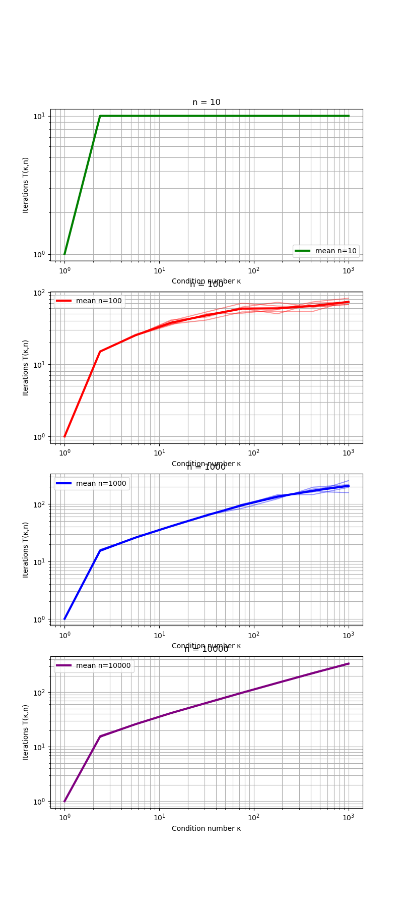
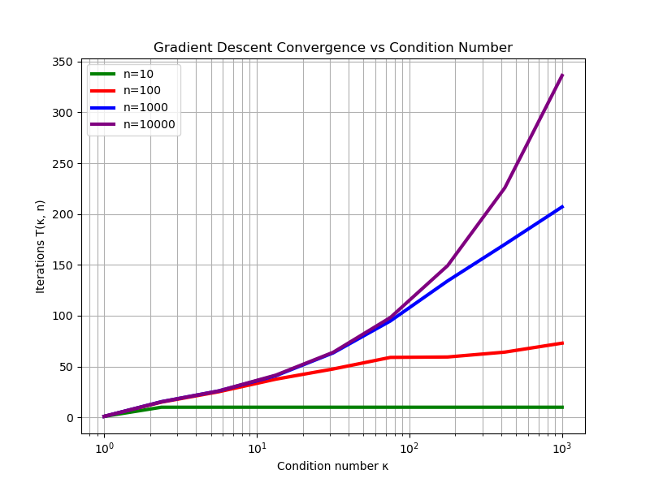
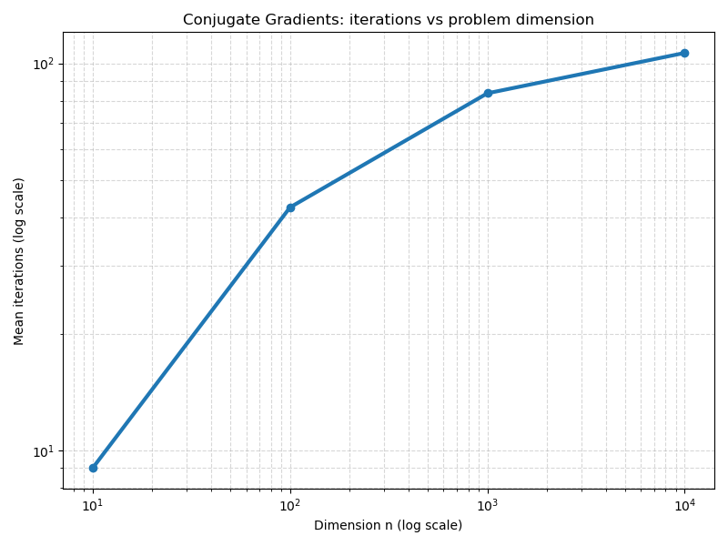
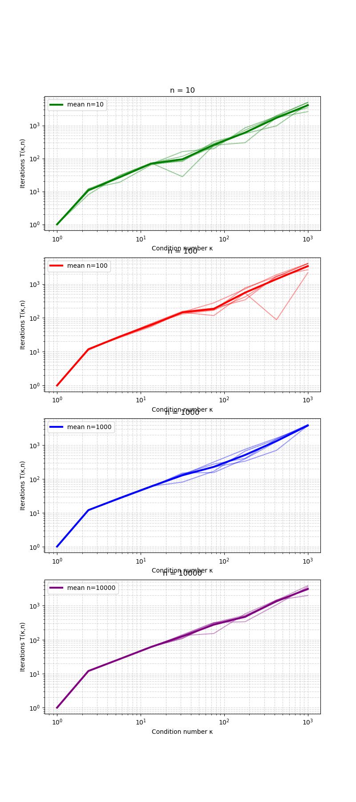
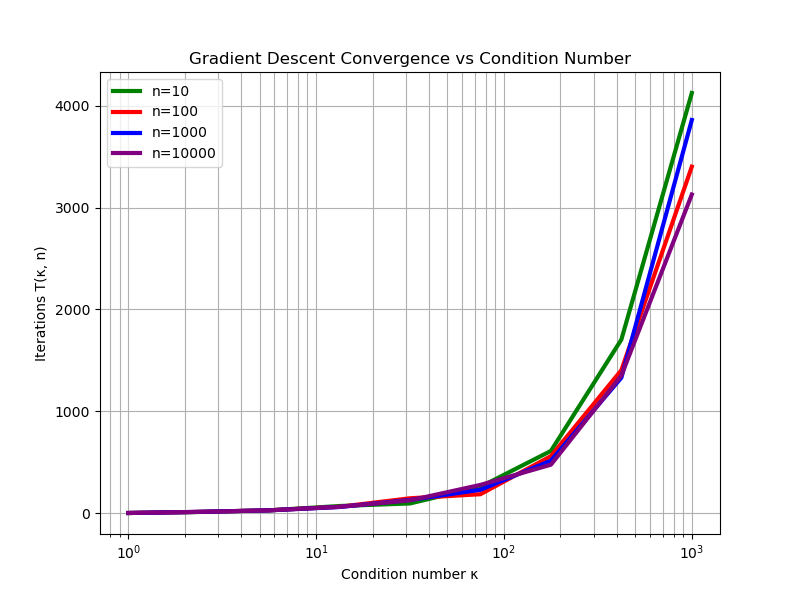
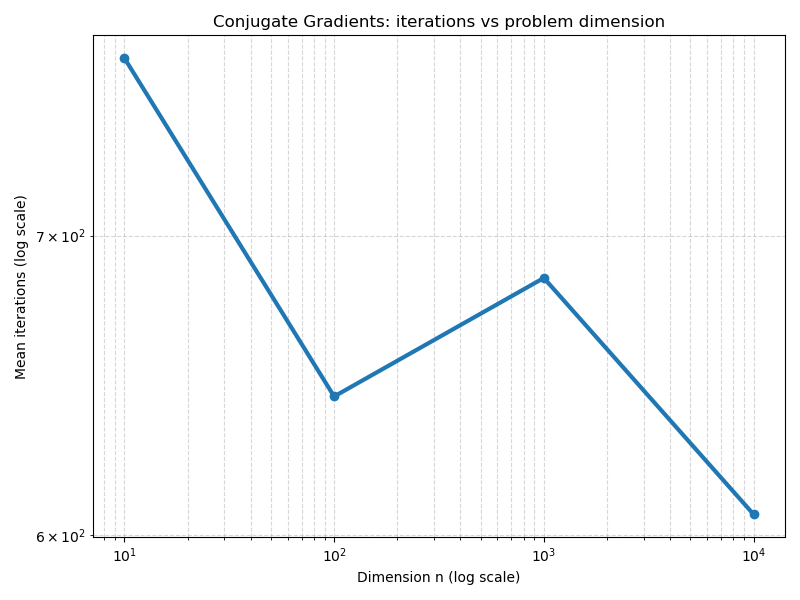
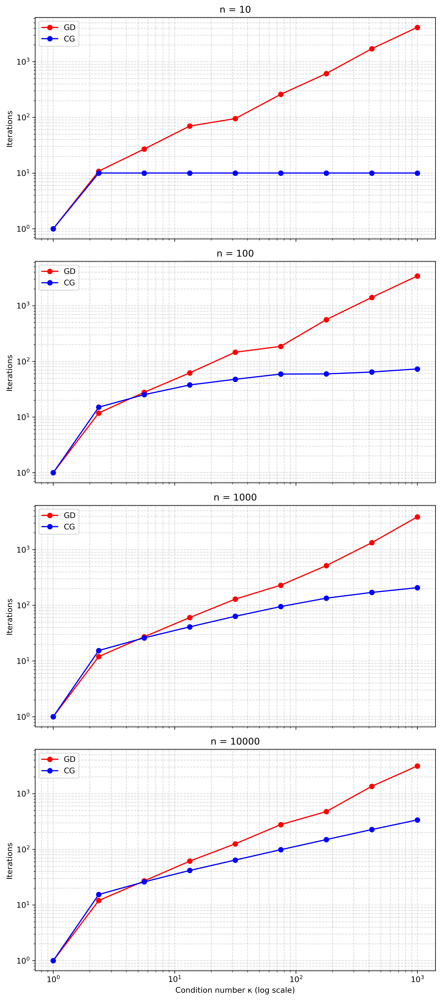

---

## 3. Эксперимент 2.3  
Выбор размера истории в методе L-BFGS

### 3.1 Постановка задачи
Исследовать влияние размера истории `L` в L-BFGS на:
- скорость сходимости,
- итоговое время работы,
- вычислительные затраты итерации (без учета стоимости оракула).

### 3.2 Функции, данные, параметры
- Оракулы:
  - регрессия: `LogCoshL2Oracle`,
  - классификация: `ExponentialLossL2Oracle`.
- Датасеты LIBSVM:
  - регрессия: `abalone_scale`,
  - классификация: `a9a`.
- Регуляризация: `λ = 1/m`, начальная точка: `x0 = 0`.
- Размер истории: `L ∈ {0, 1, 5, 10, 50, 100}`.

### 3.3 Результаты
- Рисунок 2.3-1: 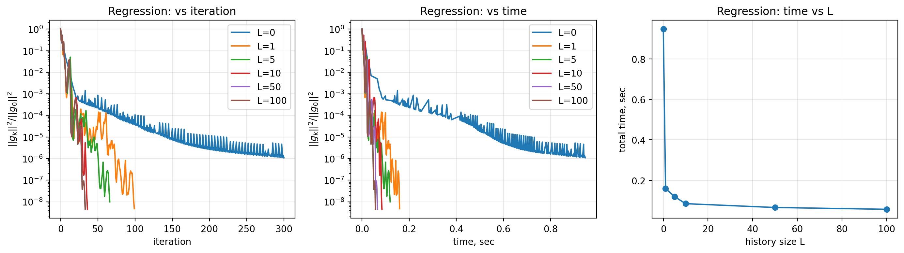
- Рисунок 2.3-2: 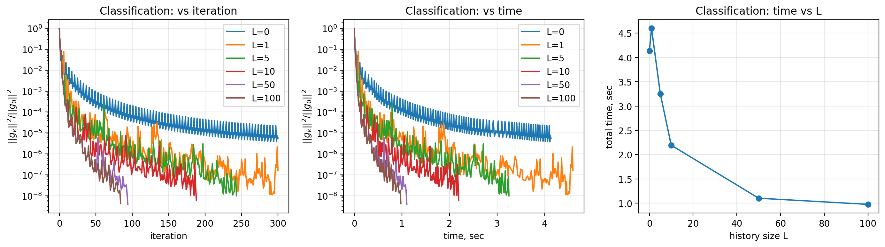
  - график `||∇f(x_k)||^2 / ||∇f(x_0)||^2` vs iteration (log-scale),
  - график `||∇f(x_k)||^2 / ||∇f(x_0)||^2` vs time (log-scale),
  - график итогового времени vs `L`.

### 3.4 Анализ
- Память L-BFGS: `O(nL)` (хранятся пары `(s_i, y_i)`).
- Стоимость двухцикловой рекурсии: `O(nL)` на итерацию (без оракула).
- При малых `L` обычно наблюдается резкое ускорение относительно `L=0`.
- После некоторого `L` возникает плато: дальнейший рост истории слабо улучшает сходимость, но увеличивает затраты итерации.

### 3.5 Выводы
- Существует “золотая середина” для `L` по времени.
- Слишком большой `L` может ухудшать время, несмотря на меньшее число итераций.

---

## 4. Эксперимент 2.4  
Сравнение эффективности методов на реальных задачах машинного обучения

### 4.1 Постановка задачи
Сравнить `GD`, `Newton`, `Nonlinear CG`, `HFN`, `L-BFGS(L=10)` на реальных ML-задачах по:
- значению функции,
- времени,
- относительной норме градиента.

### 4.2 Функции, данные, параметры
- Оракулы: `LogCoshL2Oracle`, `ExponentialLossL2Oracle`.
- Датасеты: LIBSVM (`abalone_scale`, `a9a`), `λ = 1/m`, `x0 = 0`.
- Параметры методов:
  - NLCG: Polak–Ribiere + restart + line search (strong Wolfe),
  - HFN: адаптивный внутренний критерий, line search с `α0 = 1`,
  - L-BFGS: `L = 10`.

### 4.3 Результаты
- Основные методы (без GD и Newton):
  - 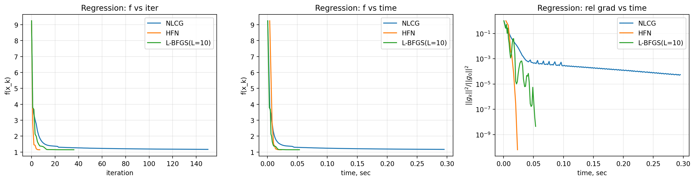
  - 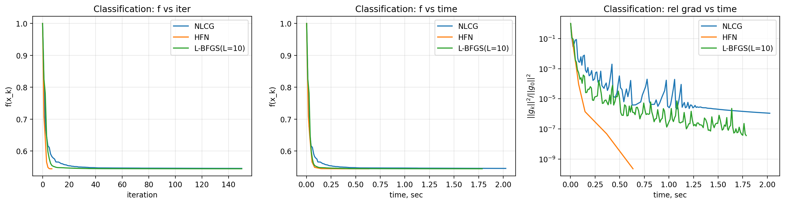
- Отдельно GD:
  - 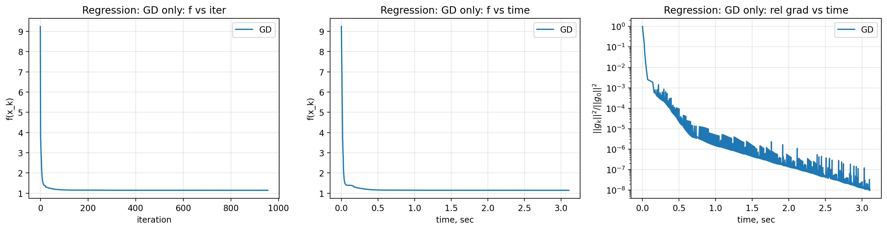
  - 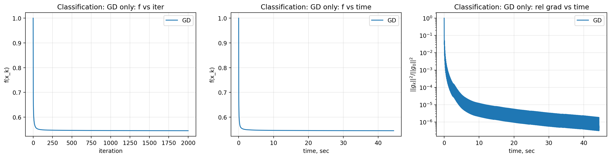
- Отдельно Newton:
  - 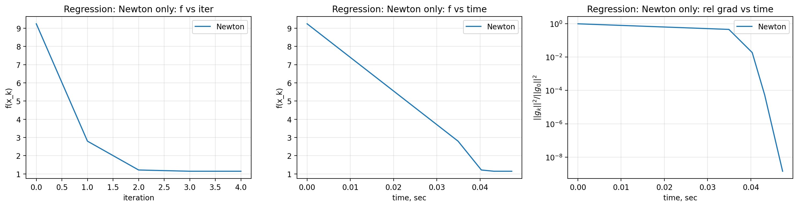
  - 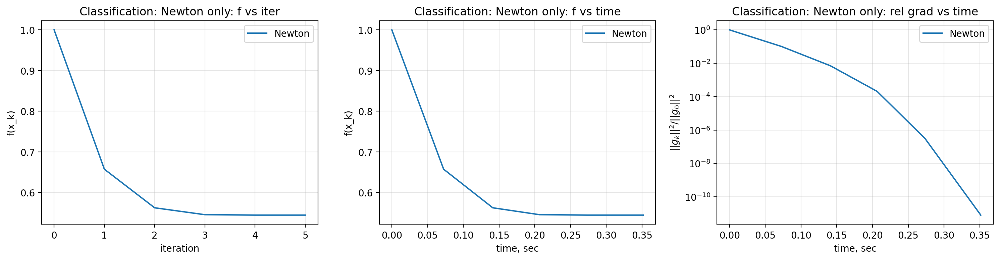
  - `f(x_k)` vs iteration,
  - `f(x_k)` vs time,
  - `||∇f(x_k)||^2 / ||∇f(x_0)||^2` vs time (log-scale).

### 4.4 Выводы
- Метод-лидер по числу итераций не всегда лидер по времени: в связке HFN vs L-BFGS у HFN меньше внешних итераций, но по времени сходимости `f` они идут примерно на одном уровне.
- HFN делает дорогую внутреннюю работу (CG + hess_vec), что может увеличивать время.
- L-BFGS часто дает лучший компромисс “качество/время” на практических sparse ML задачах.

---

## 5. Эксперимент 2.5  
Микропрофилирование вычислительных затрат

### 5.1 Постановка задачи
Разложить время работы методов по компонентам:
- оракул (`func/grad/hess_vec`),
- внутренняя линейная алгебра алгоритма,
- линейный поиск.

### 5.2 Данные и параметры
- Задача классификации на `a9a`, `ExponentialLossL2Oracle`.
- Сравниваем: NLCG, HFN, L-BFGS.
- Используется одинаковый тип line search (Wolfe).

### 5.3 Результаты
- Рисунок 2.5-1: 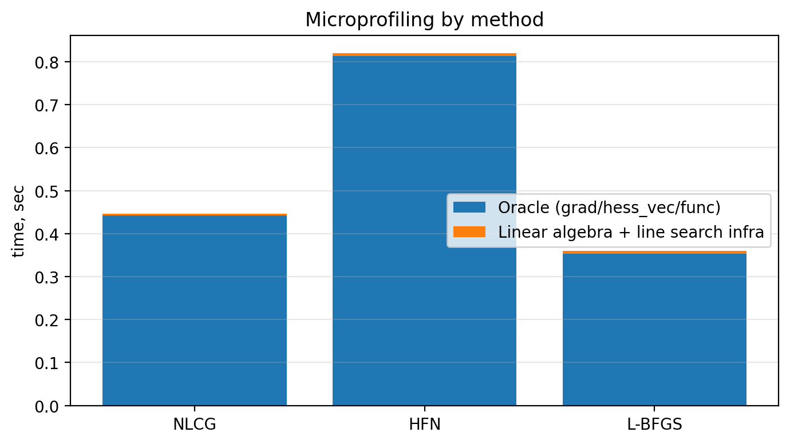
  - столбчатая диаграмма долей времени.

### 5.4 Выводы
- Наиболее “дорогой” компонент зависит от метода и структуры задачи.
- У HFN заметный вклад дают операции `hess_vec` и внутренний CG.
- У методов первого порядка может доминировать линейный поиск при тяжелых вызовах `func/grad`.

---

## 6. Эксперимент 2.6  
Оптимизационная точность против качества предсказания

### 6.1 Постановка задачи
Показать, как уменьшение оптимизационной ошибки связано (или не связано) с улучшением качества на test.

### 6.2 Функции, данные, параметры
- Train/test split: `80/20`.
- Метод: L-BFGS (высокая точность).
- Метрики:
  - классификация: Accuracy,
  - регрессия: MSE (при необходимости MAE).

### 6.3 Результаты
- Рисунок 2.6-1: 
- Рисунок 2.6-2: 
  - левая ось: `f_train`, `||∇f||` (логарифмическая),
  - правая ось: test-метрика.

### 6.4 Выводы
- После определенного уровня оптимизационной точности улучшение train-цели перестает заметно улучшать test-метрику.
- Это согласуется с идеей о “пороге достаточной оптимизации” в задачах ML.

---

## 7. Общие выводы по лабораторной
- Продвинутые методы (L-BFGS, HFN, NLCG) существенно ускоряют сходимость относительно базовых подходов.
- Эффективность по времени определяется не только числом внешних итераций, но и ценой итерации.
- Для практики важен баланс: выбор метода, точности, line search, размера памяти и структуры данных.
